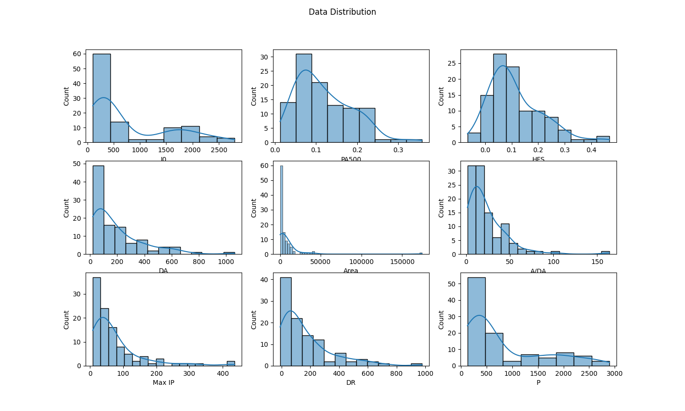
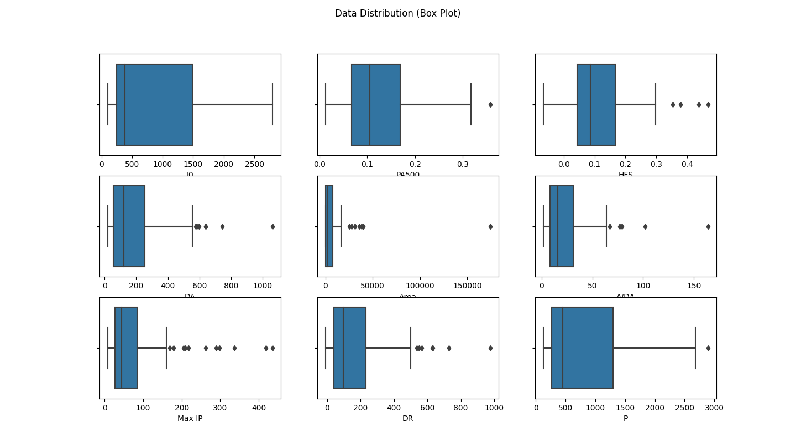
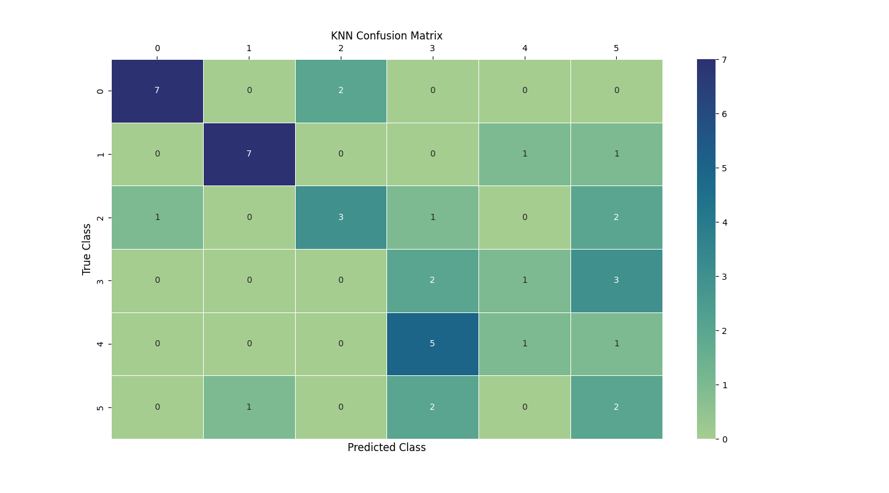

## Breast Tissue Prediction Model

This program creates a model which predicts [breast tissues](https://archive.ics.uci.edu/ml/datasets/breast+tissue) using the value of their electrical impedance measurements.

#### Data Distribution

#### Data Distrubtion (Box Plot)

#### Confusion Matrix (KNN)

Confusion Matrix (Decision Tree)

